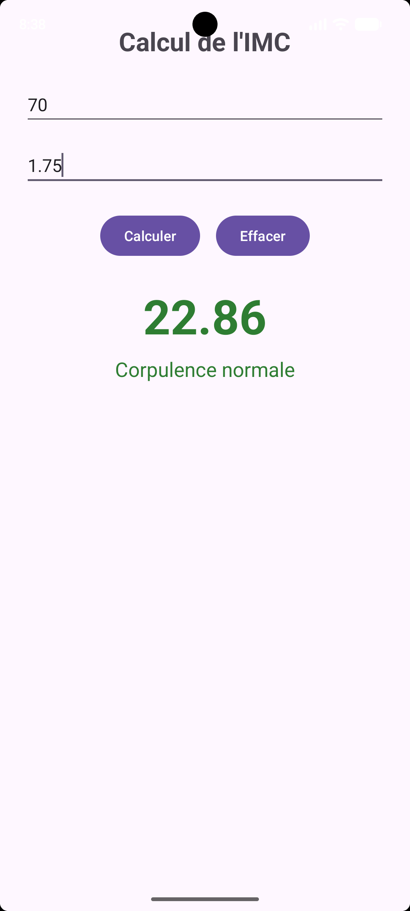

# CalculIMC

**Nom et prénom :** Mohamed Aziz Grolli
**Groupe :** L3DSI G2
**Langage :** Kotlin

## Description
Application Android qui calcule l'indice de masse corporelle (IMC) à partir du poids et de la taille saisis, puis affiche la valeur et une catégorie d'interprétation avec une couleur adaptée.

## Fonctionnalités
- Saisie du poids (kg) et de la taille (m) avec clavier numérique décimal
- Bouton Calculer : calcule l'IMC = poids / (taille × taille), arrondi à 2 décimales
- Catégorie affichée selon la valeur : Insuffisance pondérale, Corpulence normale, Surpoids, Obésité modérée, Obésité sévère, Obésité morbide
- Couleur du résultat adaptée à la catégorie (orange, vert, rouge, rouge foncé)
- Bouton Effacer : vide les champs et le résultat, remet le curseur sur le champ Poids
- Validation des saisies : champ vide ou valeur négative/nulle → message d'erreur (Toast), sans fermeture de l'application
- Résultat conservé après rotation de l'écran
- Textes déclarés dans `strings.xml`

## Captures d'écran

## Fichiers principaux
- `app/src/main/res/layout/activity_main.xml`
- `app/src/main/java/com/example/calculimc/MainActivity.kt`
- `app/src/main/res/values/strings.xml`

## Compte rendu : difficultés rencontrées
- [À compléter — par exemple : gestion des saisies invalides avec toDoubleOrNull, arrondi à 2 décimales, restauration du résultat après rotation]
